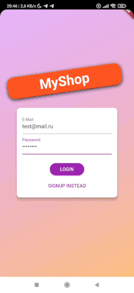
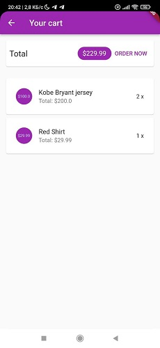
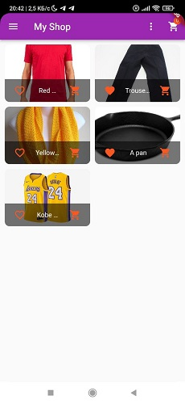
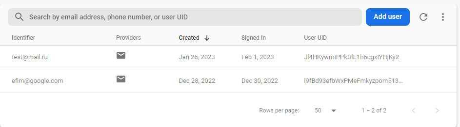
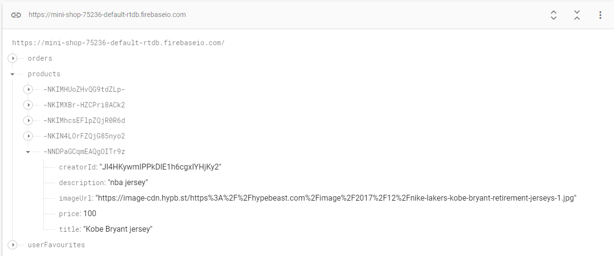

# Shop App

The app allows you to create a user, then log into his personal account. There you can add products to the cart, and then place an order. Available order history, as well as adding new products to the list of products. Products can be added to the favorites products list.
___
## Technical description

Flutter 3.3.10 • Dart 2.18.6

`flutter_bloc 8.1.1` library is used for implementing BLoC pattern.

Blocs with network repositories are used for managing the products, cart and orders respectively.

A bloc with a network repository is used for authentication.

Authentication takes places using Firebase Authentication service making requests via Google Identity Toolkit API.

Products and orders data is stored in the Firebase Realtime Database service.

___
## Useful links
[Google Identity Toolkit API docs](https://cloud.google.com/identity-platform/docs/reference/rest)

___

*NOTE* since this project is a pet project, cases of overengineering are possible

